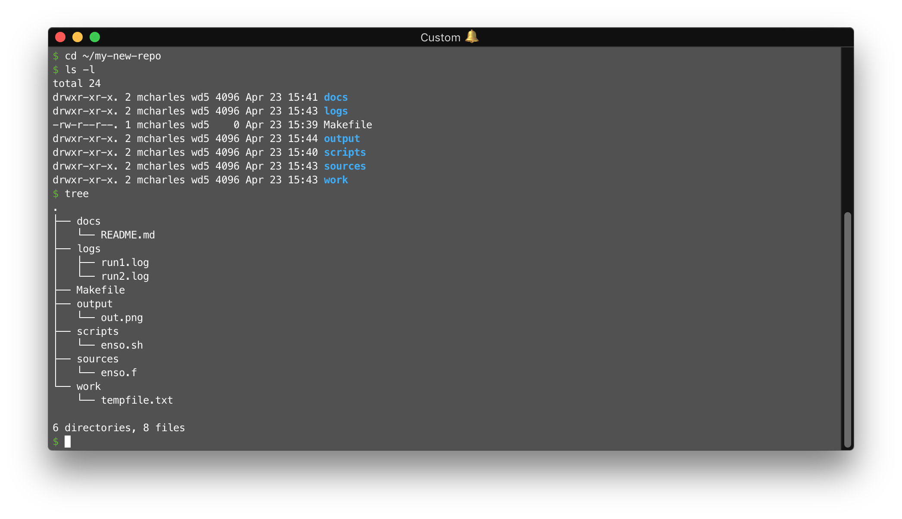
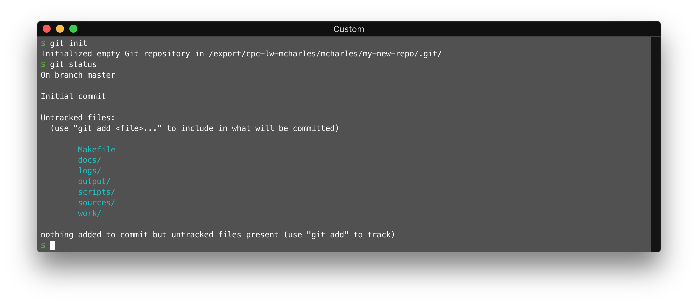
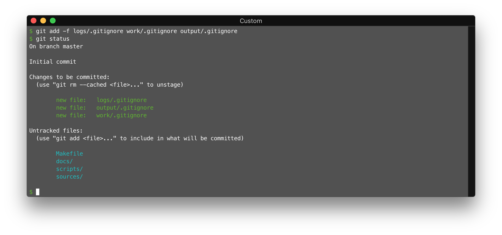
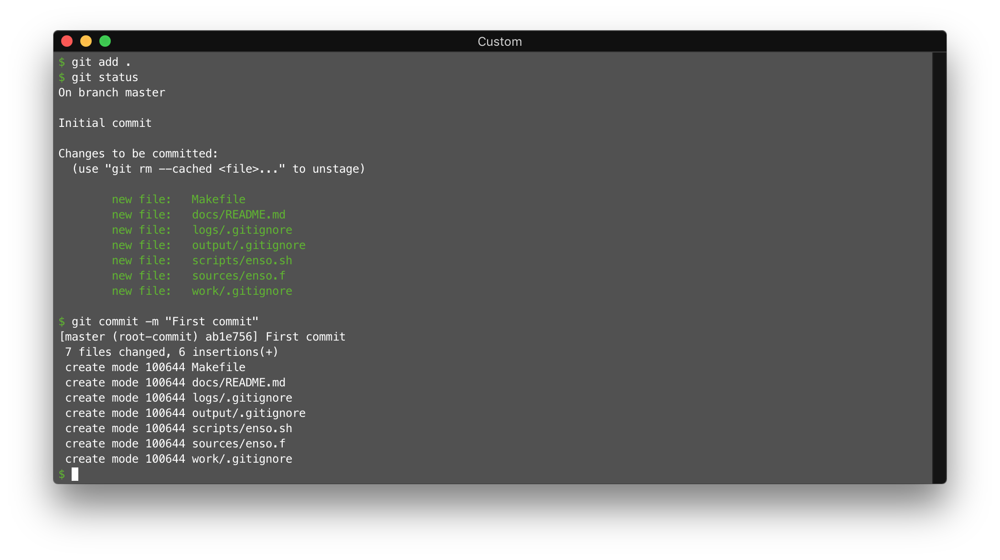
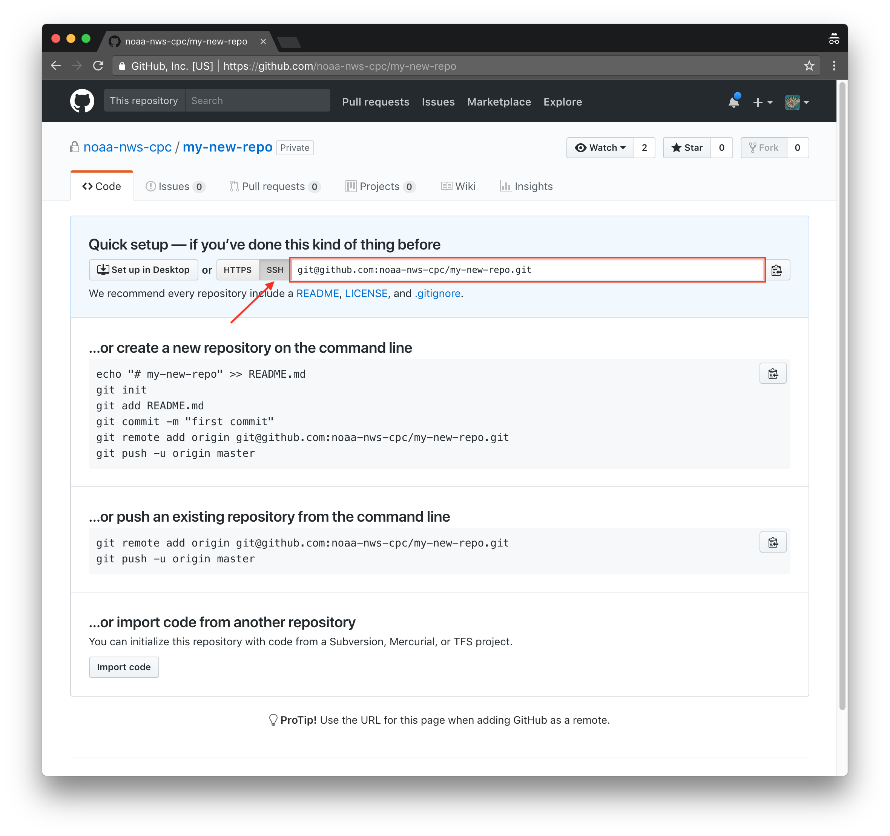

Adding Existing Code to GitHub
==============================

Step 1 - Get a GitHub repo
--------------------------

You can request a new GitHub repository ("repo" for short) by [submitting an issue](https://github.com/noaa-nws-cpc/github/issues/new?template=new_repo.md&title=New+GitHub+repo&labels=new+repo&assignee=mikecharles).

Step 2 - Go to the top-level directory of your code
---------------------------------------------------

In a terminal, navigate to the top-level directory of your code in a terminal. For example, let's say
I have some code on cpcwork2:



Step 3 - Backup your code
-------------------------

Make a backup of your code in case anything goes wrong!

    $ cp -rp . ../my-new-repo_BACKUP

Step 3.5 - Remove .svn directories (optional)
---------------------------------------------

If your code is in Subversion, then this working copy has `.svn` directories hanging around that need to be removed before putting in git. Check to see if this is an SVN working copy by typing this:

    $ svn status

If it doesn't print this:

```
svn: warning: '.' is not a working copy
```

then this isn't an SVN working copy, and you can proceed to Step 4. If it is, then delete all the `.svn` directories (recursively) with this command:

    $ find . -name .svn -exec rm -rf '{}' \;

then proceed to Step 4

Step 4 - Initialize a Git repo using your code
----------------------------------------------

The `git init` command, when executed inside of a directory, will turn an existing directory into a Git repo.

Note that no files are added by default (type `git status` to see this), we'll add the files shortly.



Step 5 - Specify files to ignore
--------------------------------

When we commit code and other files to a repo, there are usually some files we don't want in there (like log files, temporary files, binary data files, etc.). We need to tell Git about these files upfront so it knows to ignore them.

In our example, there are several files that we want Git to ignore; namely anything under the `logs/`, `work/` and `output/` directories. We can do this by adding a `.gitignore` file in each of those directories, and adding a single line in the file containing a `*`.

Note that if you type `git status` you won't see `logs/`, `work/` and `output/` under "untracked files" anymore. This is because Git doesn't add empty directories to a repo, and since you're now ignoring all files in those directories, Git just thinks they're empty. We'll fix that in the next step.


[Here's](https://github.com/github/gitignore/blob/master/Python.gitignore) an example `.gitignore` file that ignores both files and directories using wildcards if you want to ignore specific files, file types, etc.

Step 6 - Add .gitignore files
-----------------------------

We can get Git to add the `logs/`, `work/` and `output/` directories, but still ignore any other files inside of them, with the `git add -f` command:



Step 7 - Add the remaining files to Git
---------------------------------------

We can now add the remaining files to Git using `git add .` (which means add everything in the current directory, but ignore files specified in any `.gitignore` files), and commit them to the local repo:



Step 8 - Get the Git URL of your new repo
-----------------------------------------

Head over to the home page for your new repo, either by searching on the [home page](https://github.com/noaa-nws-cpc) of the CPC GitHub organization, or if you have the direct link.

You'll see the URL in a box near the top of the page (see below). Make sure to switch to the SSH version before copying the URL.



Step 9 - Specify a remote for the local repo and push to GitHub
---------------------------------------------------------------

You will typically make changes to a local Git repo, and then push those changes to GitHub. This local repo we initialized has no remote yet (you can see your remote URL with `git remote -v`). We need to add a new remote (the URL you copied in the previous step) using the `git remote add` command (by convention, we always call this remote "origin"), and then push the repo to GitHub using the command `git push`:


That's it! Now your code is on GitHub. All further development should consist of making changes, staging the changes, committing the changes, and then pushing them to GitHub. Please read at least chapters 1 and 2 of the official [Git Book](https://git-scm.com/book/en/v2), and/or your class notes if you took the Git class held here last year.
